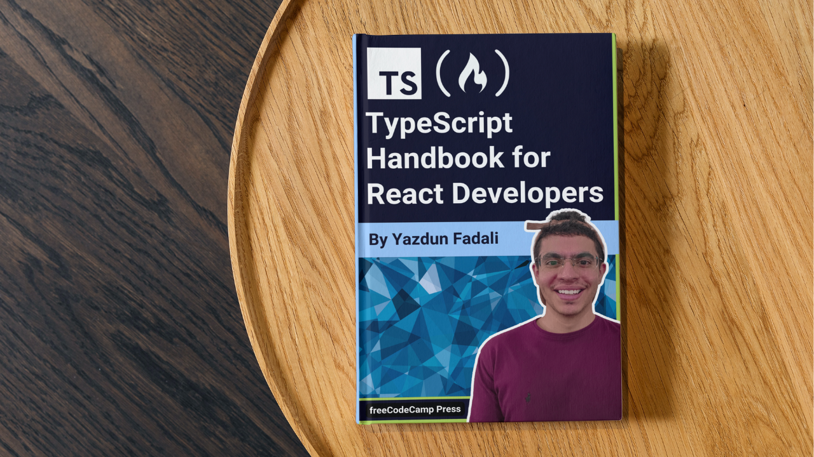

<div id="top"></div>

<!-- PROJECT LOGO -->
<br />
<div align="center">
  <a href="https://www.freecodecamp.org/">
    
  </a>

<h3 align="center">TypeScript Tutorial for React Developers</h3>

  <p align="center">
    A Step-By-Step Tutorial for Beginners
    <br />
    <a href="https://www.freecodecamp.org/news/typescript-tutorial-for-react-developers"><strong>Read on FreeCodeCamp »</strong></a>
    <br />
    <br />
    <a href="https://react-ts-fcc-tutorial.vercel.app/">View Demo</a>
    ·
    <a href="https://github.com/Yazdun/react-ts-fcc-tutorial/issues">Request Feature</a>
    ·
    <a href="https://github.com/Yazdun/react-ts-fcc-tutorial/issues">Report Bug</a>
  </p>

[](https://www.freecodecamp.org/)
[](https://reactjs.org/)
[](#)
[](https://tailwindcss.com/)
[](https://www.framer.com/api/motion/)

</div>

<div align="center">



</div>

## Introduction

Welcome to the GitHub repository for the
[TypeScript for React Developers](https://www.freecodecamp.org/news/typescript-tutorial-for-react-developers)
tutorial!

In today's JavaScript landscape, TypeScript is gaining more and more popularity,
and React developers are increasingly embracing it. If you're a React developer
looking to explore TypeScript or enhance your skills with it, this tutorial is
just for you. I'll guide you through using TypeScript in a React application by
building a classic todo app.

## Getting Started

To get started with the project in your local development environment, follow
these steps:

1. Clone the repository to your local machine.

```bash
git@github.com:Yazdun/react-ts-fcc-tutorial.git
```

2. Open the cloned folder in your preferred code editor, install the required
   dependencies by running the following command in the terminal:

```bash
npm install
```

3. To access the starter files for the tutorial, use the following command:

```bash
git checkout starter
```

4. Start the development server by running the following command:

```bash
npm run dev
```

You are now ready to go!

## Contribute to this project

Thank you for browsing this repo. Any contributions you make are **greatly
appreciated**.

If you have a suggestion that would make this better, please fork the repo and
create a pull request. You can also simply open an issue with the tag
"enhancement". Don't forget to give the project a star! Thanks again!

1. Fork the Project
2. Create your Feature Branch (`git checkout -b feature/AmazingFeature`)
3. Commit your Changes (`git commit -m 'Add some AmazingFeature'`)
4. Push to the Branch (`git push origin feature/AmazingFeature`)
5. Open a Pull Request
